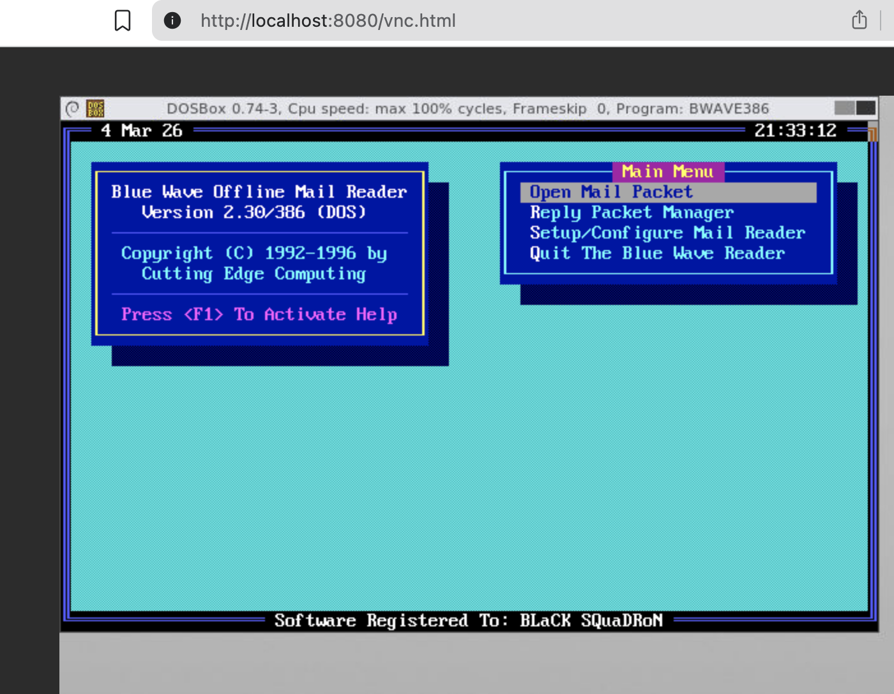

# docker-BlueWave

Run BlueWave (Offline QWK Mail Reader) inside a Docker container using noVNC for browser access.


## What is BlueWave?

BlueWave is a classic offline QWK mail reader used with Bulletin Board Systems (BBS).
This container runs BlueWave in a DOS environment and exposes it via noVNC in your browser.

In this project We use [docker-novnc](https://github.com/theasp/docker-novnc)

You can either use docker-compose or run docker by yourself.


## Image

Published on GitHub Container Registry:

ghcr.io/rainmanh/docker-bluewave

## Quick Start

Copy `.env.example` to `.env` if you want to use environment variables from a file.
Otherwise, export them manually:

```
export BLUEWAVE_DOWN=./mail-down
export BLUEWAVE_UPLOAD=./mail
```

* BLUEWAVE_DOWN: BlueWave will store in here the REP (replies) file generated by BlueWave that you need to upload to the BBS.

* BLUEWAVE_UPLOAD: It's where you have to place the `.qwk` file 


Then you just run the following:

```
docker-compose up -d
```
Then open:

http://localhost:8080/vnc.html

## Using Docker Directly

Simply using docker.

For example:

```
docker run -p 8080:8080 \
  -v ./down:/root/dos/BWAVE/DOWN \
  -v ./up:/root/dos/BWAVE/UPLOAD \
  ghcr.io/rainmanh/docker-bluewave:latest
```
Then open:

http://localhost:8080/vnc.html

## Screenshot

